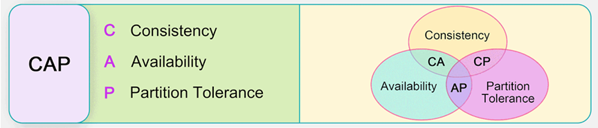
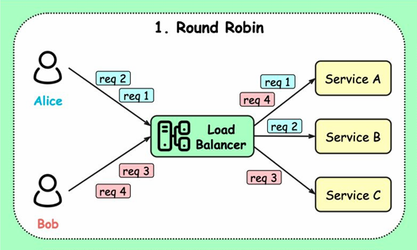
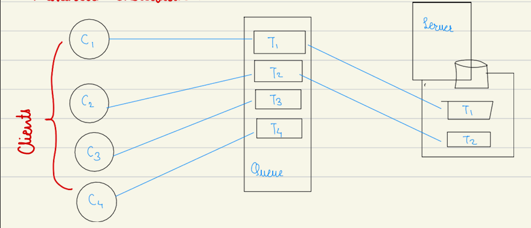
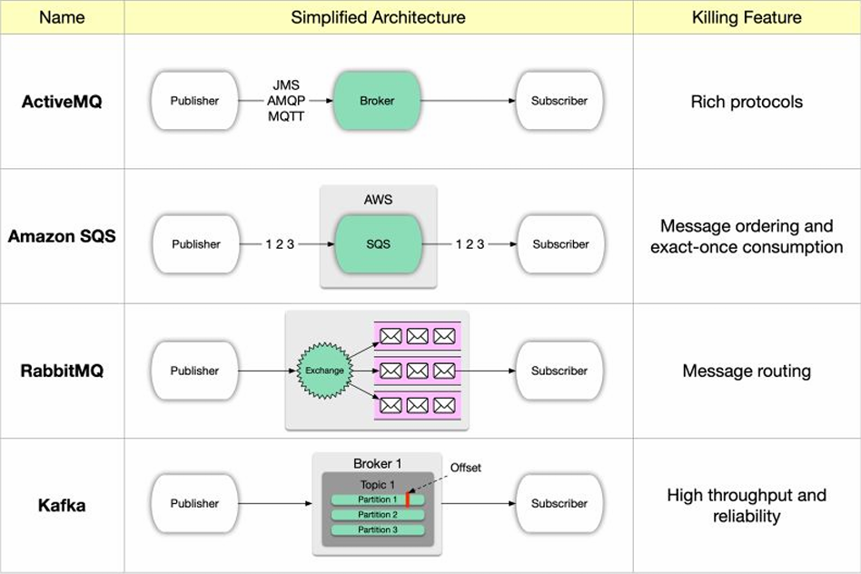
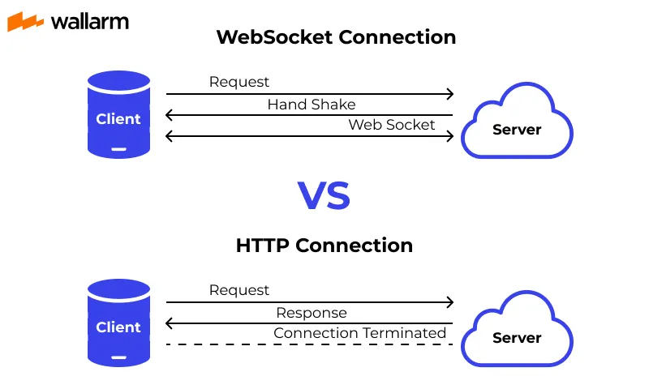

# System Design
This repo contains core and fundamental concepts of system design which is the most important aspect of computer science. Following topics will be covered and their applications:

## Index
<a href="#-cap-theorem">CAP Theorem</a>
 
<a href="#-load-balancing">Load Balancing</a>
 
<a href="#-queues">Queues</a>
 
<a href="#-producer-consumer-problem">Producer Consumer Problem</a>
 
<a href="#-pubsub-problem">Pub Sub Problem</a>
 
<a href="#-mutual-exclusion-mutex">Mutual Exclusion</a>
 
<a href="#-lock">Locks</a>
 
<a href="#-web-sockets">Web Sockets</a>

## 🔹 CAP Theorem</h2>

 
CAP Theorem states that any distributed data store can only provide any two of the following three guarantees:  
- <b>Consistency</b> = every read receives the most recent write or error  
- <b>Availability</b> = every request receives a response  
- <b>Partition Tolerance</b> = the system continues to operate in network faults

## 🔹 Load Balancing</h2>
It is the technique used to <b>distribute incoming requests, tasks, traffic etc. accross multiple resources like servers</b> so that no single resource gets overloaded

 
<b>Where load balancing is used</b> :  
1. Web Servers  
2. Networks  
3. Databases  
4. Cloud Systems

 

### Load Balancing Algorithm - ROUND ROBIN
Sends each request to the next server in a cycle

 
 

 

<b>Applications of Round Robin Algorithm</b>
- **CPU Scheduling** 
- **Network Packet Scheduling**
- **Load Balancing**
- **Thread Scheduling**
- **Cloud Computing**

## 🔹 Queues</h2>
Queues are used to effectively manage requests in large-scale distributed system

 

### Messaging Queues
It is a communication system between different software services that lets them exchange data or messages in an asynchronous and reliable way.

<b>Types of Messaging Queues</b>
- ActiveMQ
- AmazonSQS
- RabbitMQ
- Kafka
- ZeroMQ

### **Real World Application of MQ**

**Netflix - Event Streaming and Monitoring**
- Netflix uses Kafka to handle billions of events per day
- Events include user activity (play, pause), system metrics and logs
- Kafka decouples producers (user actions, microservices) from consumers (recommendation engines, monitoring tools)
- Enables real time recommendations, fraud detection and analysis

**Uber – Trip Events & Communication**
- Uber relies on Kafka and RabbitMQ for handling ride events.
- Ensures ride requests are reliably delivered to multiple services in real time.

**Amazon (AWS) – Order Processing**
- Amazon uses Amazon SQS (Simple Queue Service) internally and as a cloud product.
- Customer orders are placed into queues.
- Backend services like inventory management, payment processing, and shipping consume them independently.
- Handles massive Black Friday traffic without overwhelming backend systems.

**LinkedIn – Activity Streams**
- LinkedIn originally created Apache Kafka to handle its massive activity stream.
- Every profile view, message, connection, and like is published into Kafka topics (queues).
- Supports real-time feed updates and analytics for 1B+ users.

**Spotify – Music Recommendations**
- Spotify uses Google Pub/Sub (a message queue service) for:
    - Logging user activity (what songs people play).
    - Sending events to recommendation models.
    - Handling playlist updates asynchronously.
- Decouples frontend apps from backend recommendation engines.

**Slack – Messaging Delivery**
- Slack uses RabbitMQ for delivering chat messages between users.
- Ensures message reliability even if a user is offline.

**X (Twitter) – Timeline Updates**
- X uses Kafka to distribute tweets to millions of users' timelines.
- Handles high-throughput fan-out (one tweet → millions of consumers).

 

## 🔹 Producer Consumer Problem
**Producer** - A producer is a process, thread, or program that creates or generates data/items and puts them into a shared buffer (eg. queue).

**Consumer** - A consumer is a process, thread, or program that takes data/items from the shared buffer and uses/processes them.

**Producer-Consumer Problem** :
Producers may add items when the buffer is full and consumer may remove items when buffer is empty. This may lead to corrupting of data if the process isn't synchronized.

**Importance** - In real world concurrent systems where multiple processes and threads share resources, this problem can pose serious challenges

## 🔹 PUB/SUB Problem
**Publisher** - A publisher is a process, service, or application that creates messages or events and sends them to a topic or channel. Publishers do not know who will receive the messages. Their only job is to publish messages.

**Subscriber** - A subscriber is a process, service, or application that receives messages from a topic or channel it is subscribed to. Subscribers only receive messages they’re interested in. They do not know who sent the messages.

**Pub/Sub Problem** :
- Publishers may generate messages faster than subscriber can process
- Subscriber may be offline when a message is sent
- There may be many-to-many communication (multiple publishers, multiple subscribers)

 

## 🔹 Mutual Exclusion (Mutex)
Mutual Exclusion is a concept in concurrent programming and operating system which ensures **Only one process or thread can access a shared resource at a time**. Without Mutex, shared data can be corrupted 

## 🔹 Lock
A lock is a mechanism used to enforce mutual exclusion.
- It ensures that only one thread or process can access a shared resource at a time.
- When a thread acquires a lock, it enters the critical section.
- Other threads trying to acquire the same lock must wait until it’s released.

In the critical section, thread can safely access the shared resource

**Type of Lock - Mutex (Mutual Exclusion Lock)**

Locks prevent race conditions and ensure data consistency in mutlithreaded programs

## 🔹 Web Sockets
WebSockets are a protocol that allows **full-duplex** (two-way) communication between a web client (browser) and a server over a single TCP connection.

Unlike traditional HTTP requests, which are one-way (client → server → response), WebSockets allow both client and server to send data anytime.

This makes them ideal for real-time applications.

**Popular Use Cases**
- Chat Applications – WhatsApp Web, Slack, Discord.
- Live Notifications – Social media alerts, news updates.
- Online Gaming – Multiplayer games with real-time interaction.
- Stock/Trading Apps – Real-time price updates.
- Collaboration Tools – Google Docs, Figma (live editing).

 
